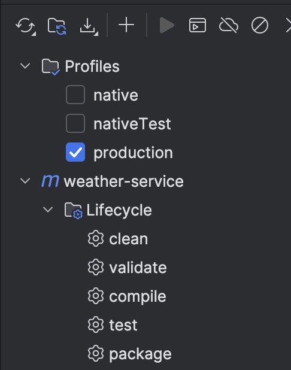
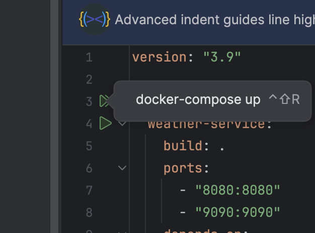

# Weather Service

Это приложение предоставляет функциональность для отображения погодных условий на основе координат (широты и долготы), используя внешний API (OpenWeatherMap). Оно также сохраняет историю запросов и позволяет просматривать их.

## Структура проекта

- **Backend**: Приложение на Spring Boot, которое обрабатывает запросы и взаимодействует с внешним API для получения данных о погоде.
- **Database**: PostgreSQL база данных, которая используется для хранения истории запросов о погоде.

## Требования

- Java 21 (или выше)
- Docker
- Docker Compose
- IDE IntelliJ IDEA
- Maven

## Установка и запуск

### 1. Настройка базы данных с помощью Docker

Для того чтобы запустить базу данных PostgreSQL с помощью Docker, выполните следующие шаги:

1. Скачайте и установите **Docker** на вашем компьютере (если у вас его нет). Подробные инструкции можно найти на [официальном сайте Docker](https://www.docker.com/get-started).

2. Используйте файл `docker-compose.yml`, чтобы запустить приложение
   
### 2. Настройка и запуск Spring Boot приложения

Склонируйте репозиторий проекта:

```markdawn
git clone git@github.com:BLADBORNE/weather-service.git
```

Соберите проект с помощью Maven:

1. Нажмите clean для очистки компиляции приложения
2. В Profiles поставьте production и нажмите package



Запустите docker desktop, зайдите в файл docker-compose.yaml и запустите приложение


### Доступ к приложению

После запуска Spring Boot приложения, сайт будет доступен по адресу:
http://localhost:8080